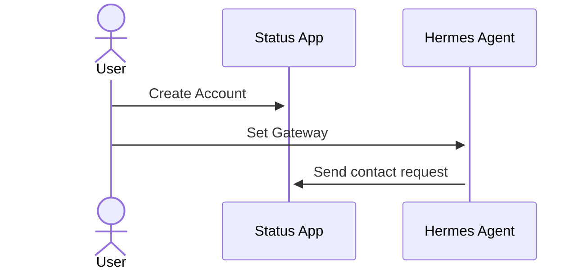
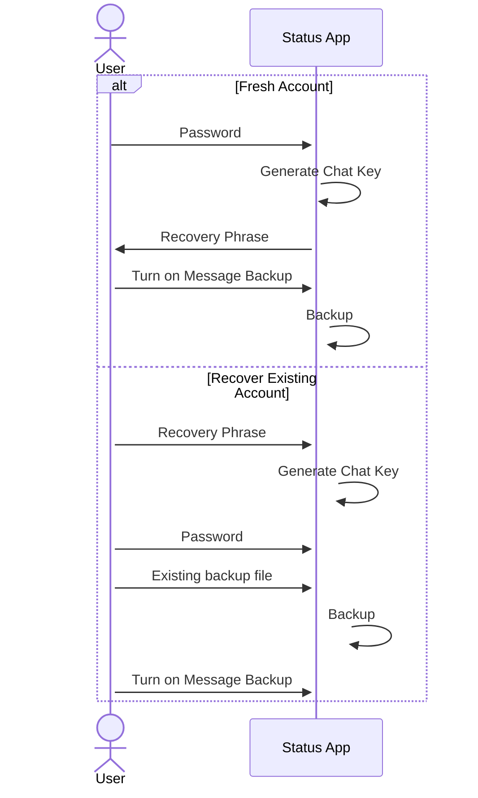
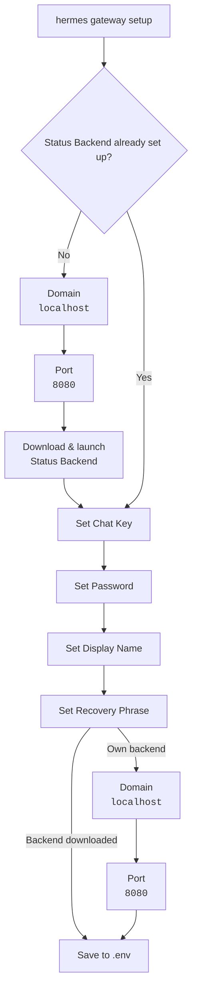
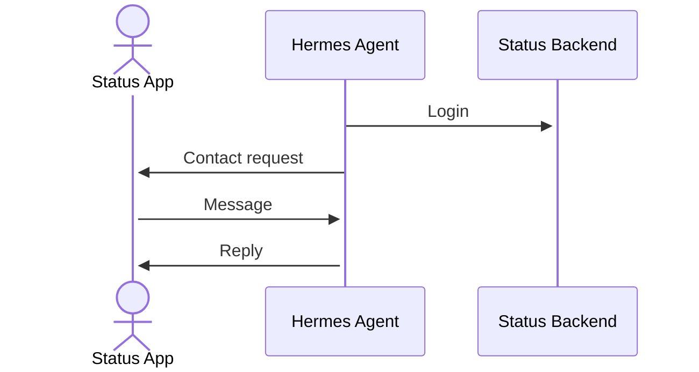

# Status App

[Status](https://status.app/) is an open-source, decentralized "super app" built on the [Ethereum](https://ethereum.org/) ecosystem that combines a [private messenger](https://status.app/blog/elements-of-private-secure-messaging-apps-2), a self-custodial crypto wallet, and decentralized community spaces. It is specifically engineered to eliminate centralized servers and relays, ensuring absolute user anonymity, data sovereignty, and censorship resistance. **Identities are cryptographic public keys rather than phone numbers or usernames.** The adapter connects Hermes to a single Status contact through a [Status Backend](https://github.com/status-im/status-go) node that **you run yourself**. There is no hosted API to sign up for. The current version of the connector is **one-to-one** and no allowlist is required.

You don't need any personally identifiable information (like your email or phone number) to create a Status profile, and your information is never shared or stored with third parties.



Status renders a small Markdown subset (bold, italic, inline code, fenced code blocks, strikethrough) but not tables and headings. Messages are capped at 2000 characters; longer replies are split automatically. Current version supports only text messages.

## Prerequisites

- Download [Status Desktop](https://status.app/) and set up an account
- Docker with Compose v2 / local installation


## Setup

### 1. Status App

#### Fresh account
1. Download Status App for your operating system from the [website](https://status.app/) or [GitHub releases](https://github.com/status-im/status-app/releases).
2. Create a **fresh account**. You only have to set a [password](https://status.app/help/profile/about-changing-your-status-password). It is stored locally and used to encrypt your account's data.
3. By default your data is backed up every 30 minutes. **Backups are encrypted and stored locally.** Make sure you turn on [message backups](https://github.com/status-im/status-python-sdk/blob/master/docs/account.md#backups).
4. Make sure you memorise your [recovery prhase](https://status.app/help/profile/back-up-and-secure-your-recovery-phrase).

#### Recover account

A [recovery phrase](https://status.app/help/profile/back-up-and-secure-your-recovery-phrase) (also known as a seed phrase or backup phrase) is a set of words that can be used to regenerate your master key. If you lose or damage your device, you can restore access to your Status data and Wallet funds using your recovery phrase on a new device. **Because your recovery phrase can be used to regenerate your master key, you must keep your recovery phrase words always secure.** 

**Note**: If you lose your recovery phrase, you lose access to your data and Wallet funds.



### 2. Hermes

You can run Status App messaging with `hermes cli` installed locally or with Docker. During the gateway setup the latest [Status Backend binary](https://github.com/status-im/status-go/releases) will be automatically downloaded and launched as a child process of the gateway.


- Restarting or stopping the gateway kills the backend with it, so `disconnect()` logs a `/statusgo/Logout … Connection refused` error on the way down. Harmless - the next connect relaunches it.
- The backend binds `STATUS_APP_DOMAIN_PORT` on whatever network the gateway container uses. With `network_mode: host` (the default in `docker-compose.yml`) that is the host's port 8080, so **nothing else may hold that port** - including a separate status-backend container.

To run status-backend as its own container instead, start it first, publish its port, and set `STATUS_APP_DOMAIN` / `STATUS_APP_DOMAIN_PORT` to reach it. Do not run both: they will fight over the port.



#### Environment Variables

| Variable | Required | Default |
|---|---|---|
| `STATUS_APP_CHAT_KEY` | Yes | - |
| `STATUS_APP_PASSWORD` | Yes | - |
| `STATUS_APP_DISPLAY_NAME` | No | `My Hermes Agent` |
| `STATUS_APP_MNEMONIC` | No | - |
| `STATUS_APP_DOMAIN` | No | `localhost` |
| `STATUS_APP_DOMAIN_PORT` | No | `8080` |
| `STATUS_APP_HOME_CHANNEL` | No | - |

Everything is written to `~/.hermes/.env` (`/opt/data/.env` in Docker).

**Note**: There is no `STATUS_APP_ALLOWED_USERS` and no `STATUS_APP_ALLOW_ALL_USERS`. The adapter drops every sender other than `STATUS_APP_CHAT_KEY` at intake and declares that to the gateway, so its own allowlist check does not apply.

##### `STATUS_APP_CHAT_KEY`

If someone wants to add you as a contact in Status, you need to share your profile with them. You can share your profile link or your QR code containing that link with your **chat key**. They can use either of those to add you to their contacts.

A **chat key** is a unique, public cryptographic identifier (a long hexadecimal string) derived from your master key that acts as your address for adding contacts and sending end-to-end encrypted messages **You must [share your chat key](https://status.app/help/profile/share-your-status-profile) with the agent, so you can become mutual contacts.**

##### `STATUS_APP_PASSWORD`

This is the [agent's password](https://status.app/help/profile/about-changing-your-status-password) that it will use to login to its Status App account. The password is stored locally where the agent is running.

##### `STATUS_APP_DISPLAY_NAME`

This is the agent's display name that will be used to login. The **display name** is the human‑readable identifier for a Status account. Display names must follow strict validation rules enforced by the library and expected by the Status application. A valid display name must satisfy all of the following conditions:

- It may contain **uppercase letters (`A–Z`)**
- It may contain **spaces (` `)**
- It may contain **numbers (`0–9`)**
- It may contain **hyphens (`-`)**
- It may contain **underscores (`_`)**
- It must be **at least 5 characters long**
- It **cannot be more than 24 characters long**
- It **cannot start or end with a space**

Characters such as spaces, punctuation, emojis, or other symbols are **not allowed**.

**Valid examples**:

```
alpha_01
STATUS-01
bot_user_5
HELLO123
node-42
```

##### `STATUS_APP_MNEMONIC`

Unlike centralized services that store usernames and passwords on servers, Status uses cryptographic keys for authentication and authorization.

A [recovery phrase](https://status.app/help/profile/understand-your-status-keys-and-recovery-phrase) (also known as a seed phrase or backup phrase) is a set of words that can be used to regenerate your master key. If you lose or damage your device, you can restore access to your Status data and Wallet funds using your recovery phrase on a new device. Because your recovery phrase can be used to regenerate your master key, you must keep your recovery phrase words always secure.

**This is the agent's recovery phrase. Leave it empty if you want to create a new account**

##### `STATUS_APP_DOMAIN`

This is the domain address of where the agent and Status Backend will be running. If you have set up [Status Backend with Docker](https://github.com/status-im/status-python-sdk/blob/master/status_sdk/docker-compose.yaml) and are running Hermes Agent with Docker, you will have to change it.

##### `STATUS_APP_DOMAIN_PORT`

This is the port of the domain address of where the agent and Status Backend will be running.


#### Contact request

Once the environment variables are set, the agent will send `STATUS_APP_CHAT_KEY` a contact request. **The request must be accepted it in Status on your phone or computer.** Until you do, the connection cannot finish and times out. The gateway keeps retrying every 30 seconds to 5 minutes.

